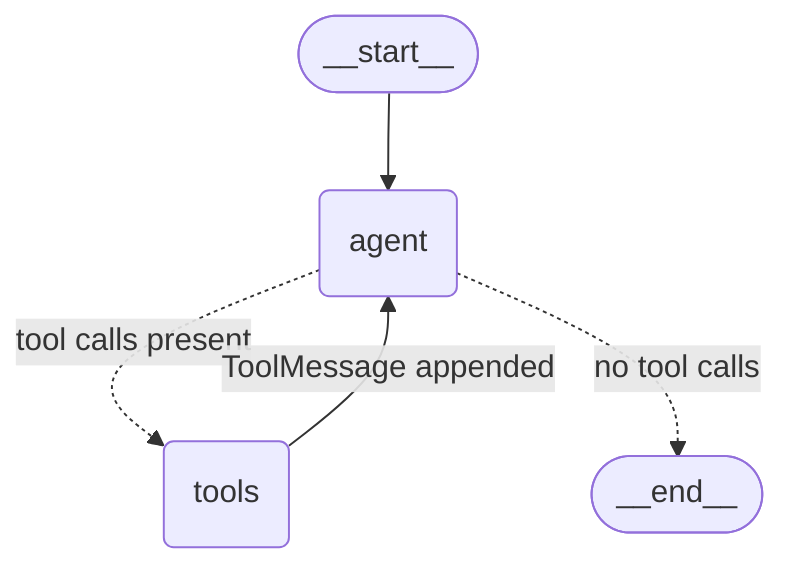

# Reserchia

A LangGraph agent running DeepSeek V4 Flash through OpenRouter, with one tool: the current
date and time.

## Setup

```bash
uv sync
cp .env.example .env      # then paste your key into OPENROUTER_API_KEY
```

Get a key at <https://openrouter.ai/keys>.

## Run

```bash
uv run reserchia
```

```
Reserchia — deepseek/deepseek-v4-flash-0731 (reasoning off)
Commands: /reset to clear memory, /exit to quit.

> what time is it in Tokyo?

  [tool] get_current_datetime(timezone='Asia/Tokyo')
    ISO 8601: 2026-08-04T02:14:52+09:00
    Date: 2026-08-04
    Day of week: Tuesday
    ... (+3 more lines)

It's just past 2:14 AM on Tuesday, August 4th in Tokyo.
```

With `OPENROUTER_REASONING=enabled` the model's thinking streams first, under `[thinking]`.

Conversation memory lasts for the life of the process (`InMemorySaver`); `/reset` starts a
fresh thread.

## The graph

A ReAct loop wired explicitly in `agent.py` — `agent` calls the model, `tools_condition`
routes on whether the reply carried tool calls, and `ToolNode` runs them and hands control
back. The cycle repeats until the model answers without calling a tool.



State is `MessagesState`, so every node appends to one growing message list — which is why
the reasoning round trip in `llm.py` matters: each trip around the loop resends the whole
history, assistant messages included.

## Layout

| File | Role |
|---|---|
| `config.py` | Environment → `Settings` |
| `llm.py` | `ChatOpenRouter` — the model, plus the reasoning round trip below |
| `tools/datetime_tools.py` | The one tool |
| `tools/__init__.py` | `TOOLS` registry |
| `agent.py` | The `StateGraph` |
| `cli.py` | The REPL |

## Adding a tool

1. Write a `@tool`-decorated function in `src/reserchia/tools/`. Its docstring is what the
   model sees — write it for the model, and describe every argument.
2. Add it to `TOOLS` in `tools/__init__.py`.

That's it — `agent.py` binds whatever is in `TOOLS`, and `ToolNode` executes it.

## Configuration

| Variable | Default | Notes |
|---|---|---|
| `OPENROUTER_API_KEY` | — | Required |
| `OPENROUTER_BASE_URL` | `https://openrouter.ai/api/v1` | OpenAI-compatible endpoint |
| `OPENROUTER_MODEL` | `deepseek/deepseek-v4-flash-0731` | Any OpenRouter model id |
| `OPENROUTER_REASONING` | `disabled` | `enabled` \| `disabled` |
| `OPENROUTER_REASONING_EFFORT` | `low` | `minimal`…`max`; only sent when reasoning is on |
| `OPENROUTER_TEMPERATURE` | `0` | |
| `OPENROUTER_SITE_URL` | — | Optional `HTTP-Referer`, for OpenRouter's leaderboards |
| `OPENROUTER_APP_NAME` | — | Optional `X-Title` |

## Why `llm.py` looks the way it does

**Do not delete the overrides in `llm.py` as dead code — they are what makes reasoning mode
usable at all.**

OpenRouter returns reasoning in two non-standard fields, `reasoning` (plaintext) and
`reasoning_details` (structured), and
[its docs](https://openrouter.ai/docs/use-cases/reasoning-tokens) require the structured one
to come back when the conversation continues — which, in an agent, it always does:

> When passing back `reasoning_details`, preserve the exact sequence returned by the model —
> no rearranging or modification permitted.

`langchain_openai` drops both. From its own `_convert_message_to_dict` docstring:

> Non-standard response fields added by third-party providers (e.g. `reasoning_content`,
> `reasoning_details`) are **not** extracted or preserved.

So a stock `ChatOpenAI` reasons on the first call and loses it the moment a tool result comes
back. `ChatOpenRouter` closes the round trip in three overrides:

- `_create_chat_result` — capture reasoning from non-streaming responses
- `_convert_chunk_to_generation_chunk` — capture it from streaming deltas. Not optional: the
  REPL streams, and LangGraph's `stream_mode="messages"` attaches a callback handler that
  forces the streaming path even though the graph node calls `llm.invoke()`.
- `_get_request_payload` — re-inject it into outbound assistant messages

### The streaming trap

`reasoning_details` arrive as deltas, and LangChain merges chunk `additional_kwargs` with
`merge_lists`, which field-merges any two list items sharing an integer `index` — concatenating
*every* string field, not just the payload. Two chunks of one detail merge to
`format: "deepseek-v4deepseek-v4"`, corrupting precisely the structure OpenRouter says to send
back unmodified.

So deltas are stored as fragments with `index` renamed to `__or_index`, which makes
`merge_lists` append them verbatim, and `_coalesce()` stitches them back at request time —
concatenating only `text`/`summary`/`data` and passing every other field through untouched.

With `OPENROUTER_REASONING=disabled` there is nothing to carry and all three overrides degrade
to no-ops, so one class covers both modes. `_get_request_payload` also *strips* stale reasoning
when reasoning is off, so flipping the toggle mid-conversation stays valid too.

### Note on `langchain-openrouter`

There is a separate `langchain-openrouter` package with its own `ChatOpenRouter`. This project
does not use it: it pulls in a second SDK, and the goal here was the OpenAI-compatible path.
The local class is unrelated despite the shared name.
