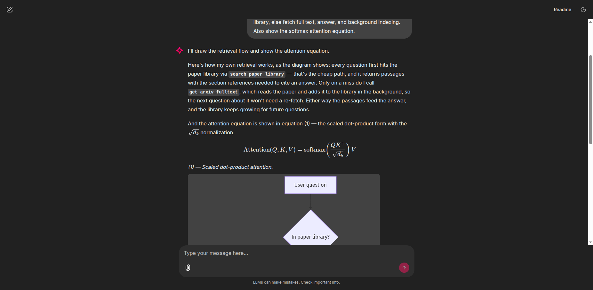
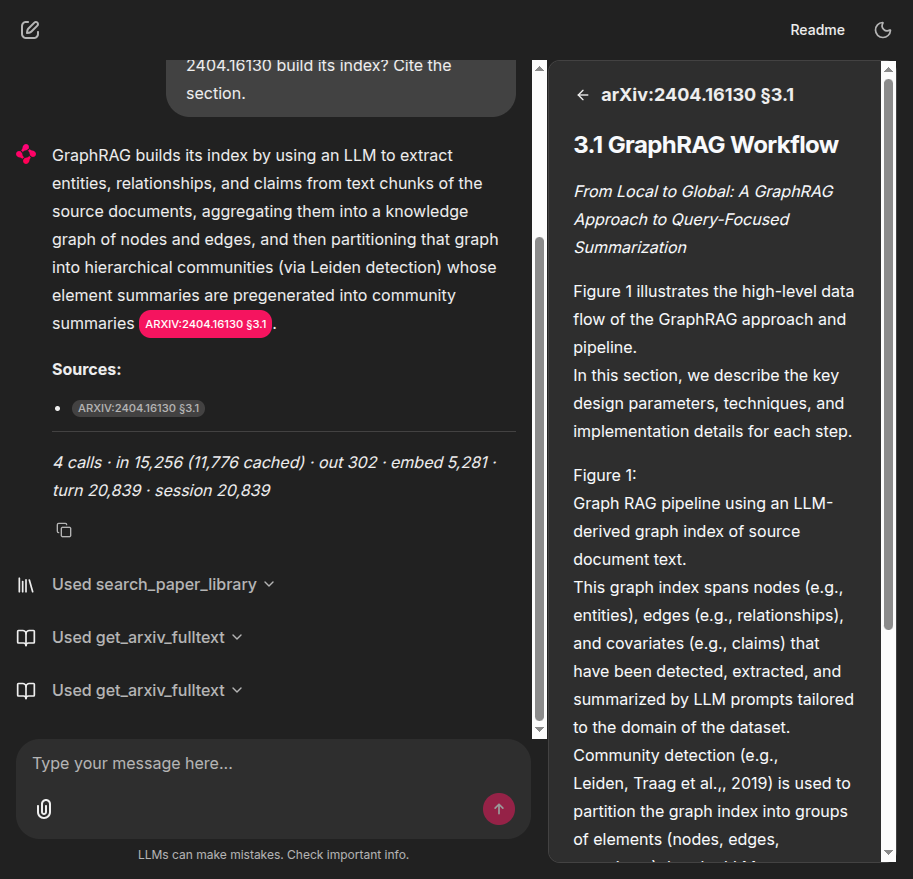

## Reserchia

<div align="center">

</div>
<p align="center">
    📚 A self-hosted research assistant that reads arXiv papers <b>once</b>, remembers them, and answers with citations you can check
    <br>
    🔎 Hybrid retrieval over your own paper library — <a href="rag-eda/REPORT.md" target="_blank">measured, not guessed</a>
    <br>
    🐳 Runs as a terminal REPL or a <a href="#running-as-a-service-docker" target="_blank">Docker stack</a> that survives a reboot
</p>

<p align="center">
    
    
    
    
</p>

### Introduction

Reserchia answers questions about arXiv papers with citations that open the exact passage a claim
came from. Papers are read once and kept in a local library, so the second question about one
costs no API call.

It is built as an explicit LangGraph ReAct loop on DeepSeek V4 Flash through OpenRouter, with a
retrieval layer whose settings were chosen by experiment rather than by default: section-aligned
chunks, `bge-m3` embeddings, and dense + BM25 fusion at α = 0.5, all measured in
[`rag-eda/`](rag-eda/REPORT.md). Everything but the model and embedding calls runs on your
machine.

<div align="center">

</div>

### Key Features

- **Citations you can verify.** Every claim carries a reference that opens the retrieved passage
  in a side panel, with its relevance score — not a link to the paper's front page.
- **Reads once, remembers.** Fetching a paper also chunks, embeds and stores it in the
  background, so the next question is answered locally. Two paths run at the same time: the
  answer you are waiting for, and the indexing you are not.
- **Retrieval settings backed by measurement.** α = 0.5 was the peak on Recall@1/@5/@10 *and*
  MRR across 36 chunking configurations; dense-only was the worst setting tested. The report
  states its own confounds.
- **Draws what prose is bad at.** Mermaid diagrams for pipelines and architectures, KaTeX for
  equations. Diagrams are validated by rendering, so the model gets the parser's error in time
  to fix it.
- **Honest accounting.** Every turn reports model calls, input tokens with the cached share,
  output, embedding spend, and **the real billed cost** from OpenRouter — not an estimate.
- **Two front ends, one agent.** A terminal REPL and a Chainlit web app share the same graph,
  library, and event interpretation.

### Quick Start

```bash
git clone https://github.com/Japokkrong/Reserchia.git
cd Reserchia
uv sync
cp .env.example .env      # paste your key into OPENROUTER_API_KEY
```

Get a key at <https://openrouter.ai/keys>, then:

```bash
uv run reserchia
```

```
Reserchia — deepseek/deepseek-v4-flash-0731 (reasoning off, 83 passages in library)
Commands: /library, /stats, /reset to clear memory, /exit.

> what does 1706.03762 say about dropout? one sentence

  [tool] search_paper_library(query='dropout', paper_id='1706.03762')
    5 passage(s) from arXiv:1706.03762, best first:
    [arXiv:1706.03762 §Residual Dropout] Attention Is All You Need
    relevance 1.000
    ... (+325 more lines)

The paper applies dropout to the output of each sub-layer before it is added and
normalized, and also to the sums of embeddings and positional encodings, using a rate
of $P_{drop}=0.1$ for the base model [arXiv:1706.03762 §Residual Dropout].

Sources:
- [arXiv:1706.03762 §Residual Dropout](https://arxiv.org/abs/1706.03762)

  [tokens] 2 calls · in 8,508 (3,392 cached) · out 162 · embed 4 · turn 8,674 · $0.00055
```

That answer cost no arXiv call — the paper was already in the library. The first question about a
paper fetches it; every one after is served locally.

### Web UI

```bash
uv sync --group ui
uv run reserchia-ui          # or: chainlit run ui/app.py
```

<div align="center">

</div>

- **Citations are clickable** — `arXiv:2404.16130 §3.1` opens the passage the claim came from.
- **Tool calls are collapsible steps** showing arguments and results.
- **Reasoning is a one-click toggle** — the brain button beside the paperclip.
- **Token usage and real cost** sit under each answer.

### Running as a Service (Docker)

```bash
cp .env.example .env      # fill in the keys and generate the secrets
docker compose up -d --build
```

Then open **<http://localhost:18000>**. Every service is `restart: unless-stopped`, so the stack
returns on its own after a reboot.

| Service | Role | Storage |
|---|---|---|
| `app` | Chainlit UI on `127.0.0.1:18000` | — |
| `postgres` | chat threads, steps, elements | `pgdata` volume |
| `rustfs` | S3-compatible store for element files | `rustfsdata` volume |

The sidebar lists past sessions — click to reopen, rename, delete, or start a new one. The paper
library is bind-mounted from `~/.local/share/reserchia`, so the container and the host CLI share
one library.

```bash
docker compose logs -f app      # follow
docker compose down             # stop, keep data
docker compose down -v          # stop and delete threads + files
```

<details>
<summary><b>Looking inside the databases</b></summary>

Neither browser runs by default, so nothing extra is listening unless you ask for it.

**Postgres** — [pgweb](https://github.com/sosedoff/pgweb) is defined under a `tools` profile,
already pointed at the right database:

```bash
docker compose --profile tools up -d    # http://localhost:18081
docker compose stop pgweb               # and it stays stopped across reboots
```

**RustFS** — no extra container needed; it has its own object browser. Set
`RUSTFS_CONSOLE_ENABLE=true` in `.env`, then:

```bash
docker compose up -d rustfs             # http://localhost:19001/rustfs/console/
```

Sign in with `RUSTFS_ACCESS_KEY` / `RUSTFS_SECRET_KEY`. Mind the path — the root of that port
is still the S3 API and answers `403` to an unsigned request, which looks like a failed console
but is not one.

</details>

> [!IMPORTANT]
> The app is published on `127.0.0.1` and authentication is passwordless — the loopback binding
> is the only thing keeping it off your network. Changing the port mapping to `"18000:8000"`
> exposes your API keys to anyone on the LAN.

### Tools

| Tool | Purpose |
|---|---|
| `search_paper_library` | search papers already read — tried first, costs no API call |
| `get_arxiv_fulltext` | read a paper's body; also indexes it in the background |
| `search_arxiv` / `browse_arxiv` | find papers by topic, author, or category and period |
| `get_arxiv_paper` | metadata and abstract by identifier |
| `render_diagram` / `render_equation` | show a mermaid diagram or a display equation |
| `get_current_datetime` | the present moment, for "recent work" questions |

### How Retrieval Works

```
question ──▶ search_paper_library ──▶ hit ──▶ cited answer
                     │
                    miss
                     ▼
             get_arxiv_fulltext ──▶ answer now
                     │
                     └─(background)─▶ chunk ─▶ bge-m3 ─▶ ChromaDB ─▶ next time it is a hit
```

Whether a paper is *in* the library is decided exactly, by an id lookup. Whether the retrieved
passages *answer the question* is left to the model. A similarity threshold was measured for the
second job and does not work: correct top-1 hits scored as low as 0.385 while questions the
corpus could not answer scored 0.492–0.498, so no cutoff separates them.

Full method, numbers and caveats: [`rag-eda/REPORT.md`](rag-eda/REPORT.md).

### Configuration

| Variable | Default | Notes |
|---|---|---|
| `OPENROUTER_API_KEY` | — | required |
| `OPENROUTER_MODEL` | `deepseek/deepseek-v4-flash-0731` | any OpenRouter model id |
| `OPENROUTER_REASONING` | `disabled` | `enabled` \| `disabled` |
| `OPENROUTER_EMBED_MODEL` | `baai/bge-m3` | changing it invalidates stored vectors |
| `RESERCHIA_STORE_DIR` | `~/.local/share/reserchia` | where the paper library lives |
| `RESERCHIA_RAG_ALPHA` | `0.5` | 0 = pure BM25, 1 = pure embeddings |
| `LANGSMITH_TRACING` | `false` | optional; sends prompts and passages to LangSmith |

Full list with commentary in [`.env.example`](.env.example).

### Project Layout

```
src/reserchia/
├── agent.py          the LangGraph ReAct loop
├── llm.py            ChatOpenRouter — reasoning round trip, real cost capture
├── arxiv_client.py   arXiv API: throttling, Atom parsing
├── arxiv_fulltext.py full text — LaTeXML HTML, ar5iv, PDF fallback
├── rag/              chunking · bge-m3 · ChromaDB · BM25 · hybrid search
├── visuals.py        mermaid rendering, LaTeX checking
├── observability.py  per-step timing, to a local log and LangSmith
├── turn.py           one reading of the graph's event stream, shared by both UIs
└── tools/            the nine tools the agent binds against
rag-eda/              the retrieval experiment behind the settings
ui/app.py             the Chainlit front end
```

### Documentation

| Document | Contents |
|---|---|
| [`docs/ENGINEERING.md`](docs/ENGINEERING.md) | why the code looks the way it does — the traps, with the evidence that found them |
| [`rag-eda/REPORT.md`](rag-eda/REPORT.md) | the retrieval experiment: chunking, embeddings, the α sweep, and its confounds |
| [`.env.example`](.env.example) | every setting, with commentary |

### Acknowledgements

Built on [LangGraph](https://github.com/langchain-ai/langgraph) and
[Chainlit](https://github.com/Chainlit/chainlit). Retrieval uses
[ChromaDB](https://github.com/chroma-core/chroma) and [BAAI/bge-m3](https://huggingface.co/BAAI/bge-m3);
models are served through [OpenRouter](https://openrouter.ai). Full text comes from arXiv's
[LaTeXML rendering](https://arxiv.org/help/api) and [ar5iv](https://ar5iv.labs.arxiv.org);
diagrams are rendered by [Kroki](https://kroki.io). Object storage in the Docker stack is
[RustFS](https://github.com/rustfs/rustfs).

Thanks to arXiv for maintaining an open API — please respect its
[terms of use](https://info.arxiv.org/help/api/tou.html), which this project enforces with a
three-second throttle.

### License

[Apache License 2.0](LICENSE).
