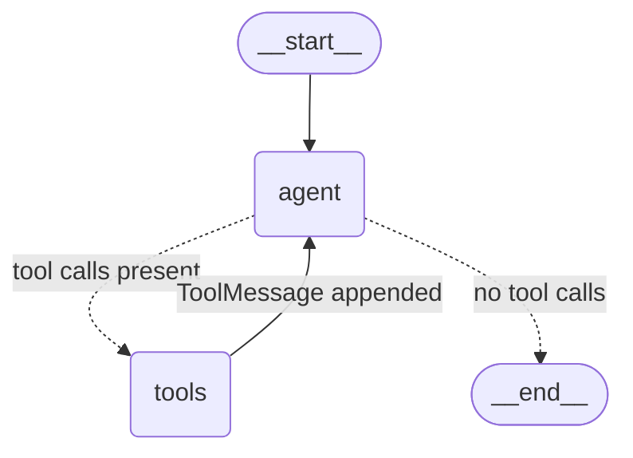

# Engineering notes

The front-page [README](../README.md) says what Reserchia does. This says *why the code looks
the way it does* — the traps found while building it, each with the evidence that found them.
Most of these fail silently, which is why they are written down.

---
# Reserchia

A LangGraph agent running DeepSeek V4 Flash through OpenRouter, with one tool: the current
date and time.

## Diagrams and equations

Papers are full of things prose is bad at — pipelines, architectures, training stages, the
formula a method turns on. Two tools let the agent show them instead of describing them:

| Tool | For |
|---|---|
| `render_diagram(mermaid, caption=)` | structure worth seeing: a pipeline, an architecture, a multi-stage process |
| `render_equation(latex, caption=)` | a display equation, captioned and numbered |


Ordinary inline maths needs no tool — `$d_k$` is typeset automatically, in answers *and* in
citation side panels, which matters because retrieved arXiv passages keep their original LaTeX.
That is the `latex = true` flag in `.chainlit/config.toml`; Chainlit ships KaTeX but leaves it
off by default.

The prompt is written as *when*, not *that*, because the failure mode is an agent that draws two
boxes for every answer. A plain factual question still comes back as one sentence.

**Rendering is the validation.** Mermaid's grammar is large and its parser is JavaScript, so a
Python check would be a heuristic that still waves through diagrams mermaid rejects. Diagrams go
to [Kroki](https://kroki.io), which runs the real parser and hands back its error verbatim —

```
Diagram not rendered, mermaid rejected it: Error 400: SyntaxError:
Parse error on line 3: ...lowchart TD  A --> ---------------------^
```

— so the model can fix it and retry *before* the answer is written. That is also why the render
is eager rather than deferred to the UI: a lazy render would surface the error too late to act
on. PNGs are cached under `<store_dir>/diagrams/<sha256>.png`, so a repeat costs nothing.

**This sends the diagram source to kroki.io.** It is model-authored text about public papers,
not your data, but it is an outbound call and you should know it happens. The local alternative,
`@mermaid-js/mermaid-cli`, needs a headless Chromium (~200 MB) — rejected as too much weight for
one feature.

In the terminal, which cannot draw, the CLI prints the mermaid source and the path of the PNG
that was rendered anyway.

## The graph

A ReAct loop wired explicitly in `agent.py` — `agent` calls the model, `tools_condition`
routes on whether the reply carried tool calls, and `ToolNode` runs them and hands control
back. The cycle repeats until the model answers without calling a tool.



State is `MessagesState`, so every node appends to one growing message list — which is why
the reasoning round trip in `llm.py` matters: each trip around the loop resends the whole
history, assistant messages included.

## arXiv tools

| Tool | For |
|---|---|
| `search_arxiv(query, category=, sort_by=, …)` | "what research exists on X" |
| `browse_arxiv(category, year, month=, …)` | the `arxiv.org/list/cs.HC/2019-01` pattern |
| `get_arxiv_paper(paper_ids)` | metadata + abstract, by identifier |
| `get_arxiv_fulltext(paper_id, section=)` | the paper's actual body text |

The first three go through the official API at `export.arxiv.org/api/query`, not the browse
pages. Results carry real `arxiv.org/abs/` links, and the system prompt tells the model to cite
those rather than recall papers from memory — and to reach for `get_arxiv_fulltext`, not the
abstract, whenever it is asked to summarize a paper or discuss its details.

Two things in `arxiv_client.py` are load-bearing:

**The throttle.** arXiv's [terms of use](https://info.arxiv.org/help/api/tou.html) require no
more than one request every three seconds on a single connection. A ReAct loop will fire
several searches back to back, so the gap is enforced in `_throttle()` under a lock rather than
trusted to callers. Expect a visible pause when the model chains two lookups.

**Raw query encoding.** The API manual documents its examples pre-encoded — `ti:%22quantum
theory%22`. That is only correct when hand-building a URL string. Handing those characters to
an HTTP client double-encodes them to `%2522`, and arXiv does not error — it silently drops
the phrase grouping:

```
ti:"attention is all you need"      ->      35 results
ti:%22attention is all you need%22  -> 459,755 results
```

So queries are built as raw strings in a params dict and `httpx` does the encoding. "Fixing"
them to match the manual re-breaks it invisibly.

One honest caveat: `browse_arxiv` filters on *submission* date while the website's listing
pages order by *announcement* date, so counts differ slightly at period boundaries — cs.HC for
2019-01 is 62 here against the site's 64.

### Full text

`get_arxiv_fulltext` tries three sources in order, because no single one covers the archive:

1. **`arxiv.org/html/<id>`** — arXiv's own LaTeXML rendering. Recent papers, *including ones
   ar5iv has not converted yet*.
2. **`ar5iv.labs.arxiv.org/html/<id>`** — LaTeXML over the back catalogue. It reports failure by
   **redirecting to `/abs/`**, not with a status code, so `arxiv_fulltext` checks the final URL.
   Miss this and you parse the abstract page as if it were the paper.
3. **`arxiv.org/pdf/<id>`** → `pypdf`. Works everywhere, reads worst.

Measured over eight papers spanning 1996–2026: arXiv HTML had three, ar5iv five, the two
together seven. Only a 1996 `hep-th` paper needed the PDF.

Parsing is stdlib `html.parser` — no beautifulsoup, no lxml. LaTeXML output is regular enough,
and one detail earns it: **every `<math>` carries an `alttext` holding the original LaTeX**, so
formulas come out as `$h_{t}$` instead of flattened MathML. Extraction starts at
`<article class="ltx_document">`, which is what keeps arxiv.org's cookie dialog and fundraising
banner out of the paper.

PDF-derived text is labelled lower-fidelity in the tool's own output, so the model hedges on it.
That is not defensive boilerplate — the 1996 paper extracts as `bla ck hole`, `vi olation`,
`effect`. Ligatures are normalized; the kerning-induced word splits can't be, since there is no
safe way to tell them from real spaces.

**Size.** A typical paper is ~10k tokens, but *A Survey of Large Language Models* is ~153k — and
`MessagesState` resends whatever lands in history on every later turn. So past
`FULLTEXT_LIMIT` (60k chars) the tool returns the abstract plus a section index instead, and the
model asks for the section it needs. Parsed papers are cached (4 deep), so those follow-ups cost
no download and no throttle wait.

## The paper library

Papers the agent has read are kept in a local ChromaDB collection, so asking about one twice
does not fetch it twice.

```
"summarize arXiv 1706.03762"
  |
  +-> search_paper_library    empty / paper absent -> escalate
  +-> get_arxiv_fulltext      answer this turn from the full text
        |
        +-> background: chunk -> bge-m3 -> ChromaDB

next session, same paper
  +-> search_paper_library    5 passages, no API call at all
```

`get_arxiv_fulltext` returns immediately and indexes on a single background worker, so the two
paths really do run at once. The worker is deliberately **not** a daemon — the CLI waits for it
on exit (up to 30s), because a daemon killed mid-write leaves a half-indexed paper.

**Where the fallback decision is made matters.** Whether a paper is *in* the library is decided
exactly, by an id lookup. Whether the retrieved passages *answer the question* is left to the
model, which is reading them anyway. It is tempting to use a similarity threshold for the
second part — that was measured and it does not work: correct top-1 hits scored as low as
0.385 while questions the corpus could not answer scored 0.492–0.498. Any cutoff rejecting the
latter also rejects real answers.

Settings come from `rag-eda/` (see [REPORT.md](rag-eda/REPORT.md)): section-aligned chunks, no
overlap, `baai/bge-m3`, and dense+BM25 fused at **α = 0.5** — the peak on Recall@1/@5/@10 and
MRR simultaneously, with both extremes clearly worse. `RESERCHIA_RAG_ALPHA` exposes it.

Two things in `rag/` are load-bearing:

- **Embedding batches are sized by token budget, not item count.** bge-m3's 8192-token context
  applies to the whole request, and exceeding it returns HTTP 429 *"engine is currently
  overloaded"* rather than a size error — badly misleading. Measured: 6,390 tokens per request
  succeeded, 12,408 failed.
- **Score normalisation floors at epsilon, not zero.** Plain min-max maps a pool's worst item to
  exactly 0.0, making it indistinguishable from an item that never appeared in that pool; a
  BM25-only result could then tie with dense's last hit and win on sort order. The test is that
  α=1.0 reproduces pure dense ranking exactly and α=0.0 pure BM25.

`/library` lists what has been read. Chroma's own hybrid search (`Knn`, `Rrf`) is hosted-only
and raises `NotImplementedError` on a local `PersistentClient`, which is why BM25 is in Python.

## Adding a tool

1. Write a `@tool`-decorated function in `src/reserchia/tools/`. Its docstring is what the
   model sees — write it for the model, and describe every argument.
2. Add it to `TOOLS` in `tools/__init__.py`.

That's it — `agent.py` binds whatever is in `TOOLS`, and `ToolNode` executes it.

## Why `llm.py` looks the way it does

**Do not delete the overrides in `llm.py` as dead code — they are what makes reasoning mode
usable at all.**

OpenRouter returns reasoning in two non-standard fields, `reasoning` (plaintext) and
`reasoning_details` (structured), and
[its docs](https://openrouter.ai/docs/use-cases/reasoning-tokens) require the structured one
to come back when the conversation continues — which, in an agent, it always does:

> When passing back `reasoning_details`, preserve the exact sequence returned by the model —
> no rearranging or modification permitted.

`langchain_openai` drops both. From its own `_convert_message_to_dict` docstring:

> Non-standard response fields added by third-party providers (e.g. `reasoning_content`,
> `reasoning_details`) are **not** extracted or preserved.

So a stock `ChatOpenAI` reasons on the first call and loses it the moment a tool result comes
back. `ChatOpenRouter` closes the round trip in three overrides:

- `_create_chat_result` — capture reasoning from non-streaming responses
- `_convert_chunk_to_generation_chunk` — capture it from streaming deltas. Not optional: the
  REPL streams, and LangGraph's `stream_mode="messages"` attaches a callback handler that
  forces the streaming path even though the graph node calls `llm.invoke()`.
- `_get_request_payload` — re-inject it into outbound assistant messages

### The streaming trap

`reasoning_details` arrive as deltas, and LangChain merges chunk `additional_kwargs` with
`merge_lists`, which field-merges any two list items sharing an integer `index` — concatenating
*every* string field, not just the payload. Two chunks of one detail merge to
`format: "deepseek-v4deepseek-v4"`, corrupting precisely the structure OpenRouter says to send
back unmodified.

So deltas are stored as fragments with `index` renamed to `__or_index`, which makes
`merge_lists` append them verbatim, and `_coalesce()` stitches them back at request time —
concatenating only `text`/`summary`/`data` and passing every other field through untouched.

With `OPENROUTER_REASONING=disabled` there is nothing to carry and all three overrides degrade
to no-ops, so one class covers both modes. `_get_request_payload` also *strips* stale reasoning
when reasoning is off, so flipping the toggle mid-conversation stays valid too.

### Note on `langchain-openrouter`

There is a separate `langchain-openrouter` package with its own `ChatOpenRouter`. This project
does not use it: it pulls in a second SDK, and the goal here was the OpenAI-compatible path.
The local class is unrelated despite the shared name.

## Persistence: Postgres, RustFS, and three silent failures

Chat threads live in Postgres, element files in RustFS. Three things about that setup fail
without an error the UI ever shows.

### The published Chainlit schema is behind the package

`steps` needs `autoCollapse` and `icon`; `elements` needs `autoPlay`, `playerConfig` and `path`.
None appear in the docs' DDL.

The data layer builds each `INSERT` from whatever keys the step carries, unfiltered, so a missing
column aborts the write — and it is caught and logged as a *warning*. The app answers normally,
the sidebar lists threads, and every one of them has zero steps. That is exactly how it presents:
"chat history is not saved".

`persistence.check_schema()` therefore runs at startup, compares Chainlit's own `StepDict` and
`ElementDict` against `information_schema`, and prints what to run:

```
reserchia: chat history will NOT be saved -- the database is missing steps.autoCollapse.
  Apply: docker compose exec -T postgres psql -U reserchia -d reserchia < docker/migrate.sql
```

`docker/migrate.sql` is idempotent. Run it after any Chainlit upgrade — `schema.sql` only runs on
an empty data directory and will never touch an existing volume.

### The object store needs two endpoints

`get_read_url` hands the **browser** a presigned URL it fetches directly. Signed against
`http://rustfs:9000` — the compose network name — the page fills with `ERR_NAME_NOT_RESOLVED`
while uploads look perfectly healthy.

So RustFS is also published on `127.0.0.1:19000`, and reads are signed by a second boto3 client
aimed there (`RUSTFS_PUBLIC_ENDPOINT`). Signing against the right host, rather than rewriting the
host afterwards, is deliberate: RustFS currently issues SigV2 URLs where the host is not part of
the signed string and a rewrite would happen to work — but SigV4 signs the host, and the rewrite
would start failing silently.

### …and a CORS rule

The page is served from `:18000`, the object comes from `:19000`, so the fetch is cross-origin
and RustFS refuses it by default. `_ensure_bucket` applies a bucket CORS rule when it creates the
bucket, so a fresh volume is self-healing rather than a manual step.

### Reopening a thread is not just redrawing it

Chainlit restores the transcript from Postgres by itself. The graph's checkpointer does not: it
starts empty, so without `@cl.on_chat_resume` the user reads a full conversation while the agent
sees an empty one, and the first follow-up answers as if nothing had been said.

The handler replays the stored user and assistant turns into the checkpointer under the thread's
own id. Tool calls and reasoning are not replayed — only the conversation as the user sees it —
which is enough for context and avoids resurrecting `reasoning_details` that may not match the
current reasoning mode.

## Observability

Timings always go to a local JSONL under `<store_dir>/logs/`; `LANGSMITH_TRACING=true`
additionally sends the trace tree to LangSmith. Both, rather than only LangSmith, because:

- **LangSmith cannot see the steps that cost time.** `embeddings.embed`, `store.query_dense`,
  `lexical.search`, the arXiv throttle and the Kroki render are plain functions, not LangChain
  runnables. A trace without them just says `search_paper_library` took two seconds.
- **`/stats` needs local data.** It cannot query a remote service with tracing off.

So `observability.track()` feeds both from one measurement, and sub-steps are added as explicit
`langsmith.trace()` spans. Verified against the API: all eight appear with latencies matching the
local log.

Three details:

- **The throttle is timed separately from the request.** A three-second wait for arXiv's rate
  limit is not a slow API, and one combined number would say the opposite.
- **A dead key must not look like a crash.** An expired key makes LangSmith's uploader emit a
  `Failed to multipart ingest runs ... 403` per batch — 21 from a single probe. Those loggers are
  muted, so stderr stays clean.
- **Spans are not free.** LangSmith's cost 84 µs each, half a BM25 query, so `track()` checks
  whether tracing is on before building one — 2 µs when off.

**Cost is the real billed figure.** OpenRouter reports it in `usage.cost` when the request asks;
`langchain_openai` drops the field, so `ChatOpenRouter` rescues it exactly as it rescues
reasoning. Hosted tools can only estimate from a price table that may not list this model.

## Branding

`public/theme.json` sets `--primary` to `285 48% 50%`. Hue 285° is the centre of the character's
hair, which samples between 280° and 300°. Theme values are HSL triples without the `hsl()`
wrapper; hex is not accepted.

Lightness was chosen for contrast, not looks: white button text needs 4.5:1, and 50% lightness at
that hue gives 5.2:1 — Chainlit's default pink managed 4.07:1. The pale tones straight from the
artwork (`#e6c8e6`, ~88% lightness) would have been unreadable as a button.

The avatar is a **square centre crop**. Chainlit's `AvatarImage` is `aspect-square` with
`object-fit: fill`, so a 16:9 source is squashed, not cropped. Regenerate the derived assets from
the source with an ephemeral Pillow — no runtime dependency, since the output is a static file:

```bash
uv run --with pillow python - <<'PY'
from PIL import Image
src = Image.open("public/Icon.jpeg").convert("RGB"); w, h = src.size
side = min(w, h); sq = src.crop(((w-side)//2, 0, (w-side)//2+side, h))
sq.resize((128, 128), Image.LANCZOS).save("public/avatars/reserchia.png", optimize=True)
sq.resize((64, 64), Image.LANCZOS).save("public/favicon.png", optimize=True)
for t in ("light", "dark"):
    src.resize((512, int(512*h/w)), Image.LANCZOS).save(f"public/logo_{t}.png", optimize=True)
PY
```

`confirm_new_chat` is off: its warning says a new chat "will clear your current chat history",
which stopped being true once conversations persisted.
