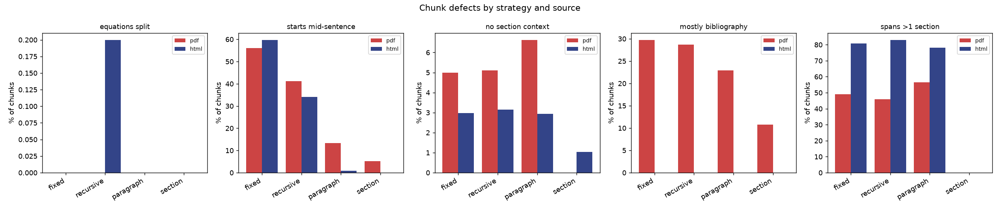
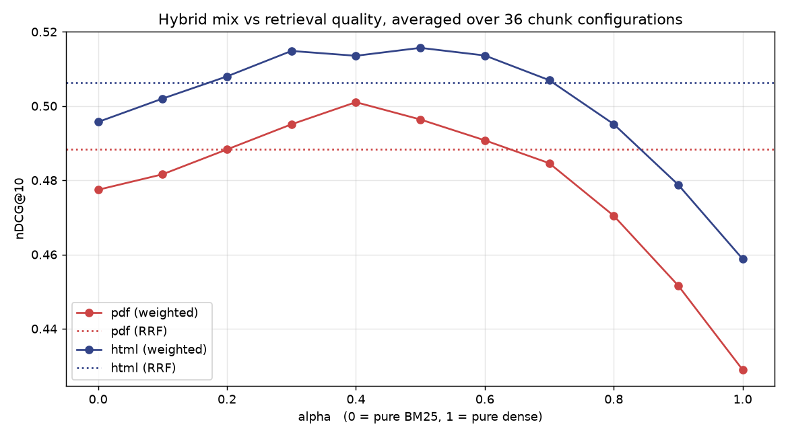
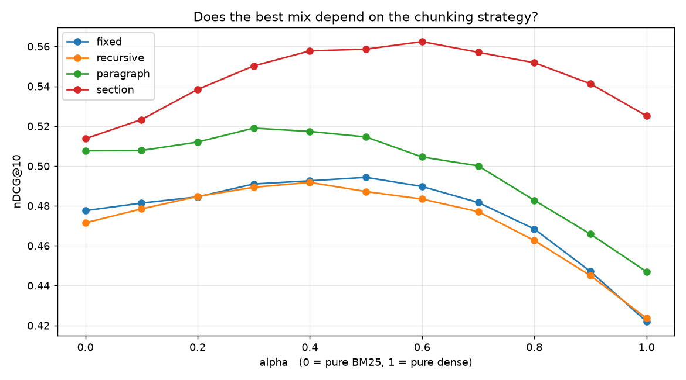
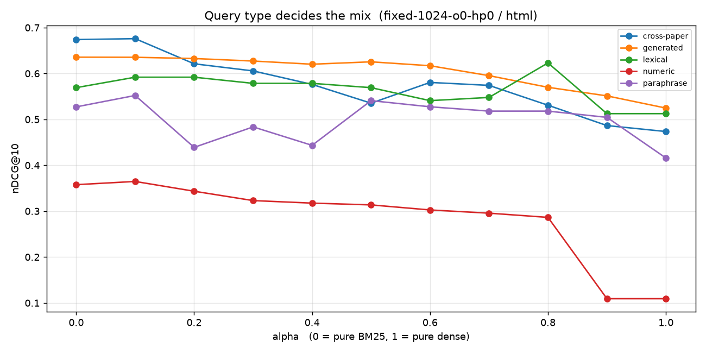

# RAG EDA — chunking, bge-m3, and hybrid retrieval on two arXiv papers

Generated by `05_retrieval_eda.py`. Every number here is measured, not estimated.

## Corpus

| paper | title | pages |
|---|---|---|
| `2601.14722v1` | Typhoon OCR: Open Vision–Language Model For Thai Document Extraction | 14 |
| `2603.10910v2` | GLM-OCR Technical Report (Zhipu AI / Tsinghua) | 17 |

They overlap heavily — both cover OCR benchmarks, layout analysis and compact-model
tradeoffs, and both have sections literally named *Stage 1–4* — so cross-paper
confusion is a real retrieval signal here rather than a contrived one.

## 1. Source: PDF text vs LaTeXML HTML

| paper | source | chars | tokens | sections | math spans | references |
|---|---|---|---|---|---|---|
| `2601.14722v1` | pdf | 50,272 | 13,436 | 1 | 0 | 27% |
| `2601.14722v1` | html | 34,521 | 8,283 | 36 | 6 | 0% |
| `2603.10910v2` | pdf | 48,007 | 14,634 | 1 | 0 | 21% |
| `2603.10910v2` | html | 35,016 | 8,948 | 40 | 11 | 0% |

The PDF is *larger* but carries less: a fifth to a quarter of it is bibliography,
which the LaTeXML tier drops outright, and it yields no section tree and no math.

With bibliographies excluded from both sides, vocabulary present in one extraction
and absent from the other is asymmetric — PDF-only short fragments (`fer`, `ing`,
`els`, `con`, `der`) are hyphenation damage:

| paper | PDF-only fragments | HTML-only fragments |
|---|---|---|
| `2603.10910v2` | 25 | 0 |
| `2601.14722v1` | 36 | 1 |

## 2. Chunking

36 configurations — 4 strategies x 3 sizes x overlap x heading-prefix — over both
sources. Defect rates, averaged within each strategy:

| strategy | source | equations split | starts mid-sentence | no section | bibliography | spans >1 section |
|---|---|---|---|---|---|---|
| `fixed` | pdf | 0.0% | 56.0% | 5.0% | 29.8% | 49.1% |
| `fixed` | html | 0.0% | 59.8% | 3.0% | 0.0% | 80.7% |
| `recursive` | pdf | 0.0% | 41.1% | 5.1% | 28.7% | 46.0% |
| `recursive` | html | 0.2% | 34.2% | 3.1% | 0.0% | 83.1% |
| `paragraph` | pdf | 0.0% | 13.3% | 6.6% | 22.9% | 56.6% |
| `paragraph` | html | 0.0% | 0.8% | 2.9% | 0.0% | 78.0% |
| `section` | pdf | 0.0% | 5.1% | 0.0% | 10.8% | 0.0% |
| `section` | html | 0.0% | 0.0% | 1.0% | 0.0% | 0.0% |



Findings:

- **`section` is the only strategy that never straddles a section boundary**, by
  construction, and it carries the least bibliography.
- **PDF text has almost no paragraph structure** — 13 blank lines against the HTML's
  191 — so `paragraph` chunking degenerates there, producing ~910-token chunks
  regardless of the 256/512/1024 target. That is a property of the source, not a bug.
- **Overlap wrecks boundary quality.** `recursive-256` on HTML starts mid-sentence in
  2.5% of chunks at zero overlap and 63% at 15%, because the overlap is measured in
  tokens and lands wherever it lands.
- Recovering a section tree from a PDF by heading regex is unreliable: 18 headings
  found against the HTML's 36 for one paper, 42 against 40 for the other.
- No chunk in any configuration exceeded bge-m3's 8192-token limit.

## 3. Embedding

`baai/bge-m3` via OpenRouter's `/api/v1/embeddings`, 4,224 chunks across 72
collections. Vectors arrive **already L2-normalised** (norm exactly 1.0), so cosine
distance and dot product agree and Chroma's cosine space is correct.

Measured cost for the full corpus: **1,286,898 tokens ≈ $0.013**.

## 4. Hybrid retrieval

59 scored queries (49 generated + hand-written), each retrieved once per configuration and re-fused at 11 alphas plus RRF.



| alpha | nDCG@10 | MRR@10 | Recall@1 | Recall@5 |
|---|---|---|---|---|
| 0.0 | 0.4866 | 0.6316 | 0.4814 | 0.8044 |
| 0.1 | 0.4918 | 0.6464 | 0.4952 | 0.8210 |
| 0.2 | 0.4981 | 0.6621 | 0.5134 | 0.8257 |
| 0.3 | 0.5050 | 0.6794 | 0.5329 | 0.8349 |
| 0.4 | 0.5073  **<- peak** | 0.6851 | 0.5352 | 0.8443 |
| 0.5 | 0.5060 | 0.6868 | 0.5365 | 0.8454 |
| 0.6 | 0.5022 | 0.6835 | 0.5360 | 0.8394 |
| 0.7 | 0.4958 | 0.6720 | 0.5218 | 0.8302 |
| 0.8 | 0.4828 | 0.6507 | 0.4954 | 0.8174 |
| 0.9 | 0.4652 | 0.6219 | 0.4629 | 0.8019 |
| 1.0 | 0.4439 | 0.5861 | 0.4251 | 0.7791 |
| RRF | 0.4973 | 0.6684 | 0.5154 | 0.8313 |

**The mix beats either extreme.** Averaged over all 36 configurations, nDCG@10 peaks
at **alpha = 0.4** (0.5073) against 0.4439 for pure dense and
0.4866 for pure BM25 — a 14% gain over
dense-only. Note that pure BM25 outranks pure dense on this corpus: these are dense
technical papers full of model names, benchmark names and numbers.

RRF reaches 0.4973 with no tuning at all — within 2.0% of the best hand-tuned alpha. If you do not
want to tune a ratio per corpus, RRF is the sane default.



**Best single configuration:** `fixed-1024-o0-hp0` on html at alpha=0.1 — nDCG@10 0.625, Recall@5 0.932, Recall@10 1.000.

| config | source | alpha | nDCG@10 | MRR@10 | R@1 | R@5 |
|---|---|---|---|---|---|---|
| `fixed-1024-o0-hp0` | html | 0.1 | 0.625 | 0.744 | 0.593 | 0.932 |
| `fixed-1024-o0-hp0` | html | 0.0 | 0.623 | 0.736 | 0.576 | 0.932 |
| `fixed-1024-o0-hp1` | html | 0.0 | 0.620 | 0.733 | 0.576 | 0.932 |
| `fixed-1024-o0-hp0` | html | 0.2 | 0.614 | 0.741 | 0.593 | 0.966 |
| `fixed-1024-o0-hp1` | html | 0.5 | 0.612 | 0.757 | 0.627 | 0.932 |
| `fixed-1024-o0-hp1` | html | 0.1 | 0.611 | 0.724 | 0.559 | 0.949 |
| `fixed-1024-o0-hp0` | html | 0.3 | 0.609 | 0.751 | 0.593 | 0.966 |
| `fixed-1024-o0-hp1` | html | 0.2 | 0.606 | 0.726 | 0.559 | 0.966 |
| `fixed-1024-o0-hp1` | html | 0.4 | 0.605 | 0.747 | 0.593 | 0.966 |
| `fixed-1024-o0-hp0` | html | 0.5 | 0.604 | 0.752 | 0.593 | 0.932 |

**HTML beats PDF as a source**: mean nDCG@10 0.5003 vs 0.4787 (4.5%), across every strategy and alpha.

### Chunk length confounds the strategy ranking

`fixed-1024` topping the table is **not** evidence that ignoring document structure
retrieves better. Chunk length correlates with the score at **r = 0.448** (n=72, alpha=0.4), and the reason is
mechanical: a chunk counts as correct when it covers half the gold span, and a
1024-token chunk covers a given span far more easily than a 200-token one.

The 1024 band makes it plain — `section-1024` produces 218-token chunks, because
arXiv sections are mostly small, and lands at the bottom:

| config (html, alpha=0.4) | mean tokens | nDCG@10 |
|---|---|---|
| `fixed-1024-o0-hp1` | 964 | 0.6053 |
| `fixed-1024-o0-hp0` | 958 | 0.5995 |
| `fixed-1024-o15-hp0` | 959 | 0.5792 |
| `recursive-1024-o15-hp0` | 1043 | 0.5700 |
| `fixed-1024-o15-hp1` | 966 | 0.5663 |
| `recursive-1024-o15-hp1` | 1050 | 0.5625 |
| `recursive-1024-o0-hp1` | 914 | 0.5623 |
| `paragraph-1024-o0-hp1` | 914 | 0.5623 |
| `recursive-1024-o0-hp0` | 908 | 0.5466 |
| `paragraph-1024-o0-hp0` | 908 | 0.5466 |
| `section-1024-o0-hp0` | 218 | 0.5327 |
| `section-1024-o0-hp1` | 225 | 0.5269 |

So the defensible reading is: **at matched chunk length the four strategies are
close**, and the visible spread is mostly length. What `section` buys is not a higher
score on this metric but the qualities section 2 measured — no straddled boundaries,
no bibliography, no mid-sentence starts — which matter for what the model is asked to
read, not for whether the span was hit. A downstream answer-quality evaluation, not a
span-overlap one, is what would separate them properly.



### Caveat on the per-category curves

The hand-written categories are small — cross-paper n=4, lexical n=2, numeric n=2, paraphrase n=2. Those curves are indicative only; do not read a peak in a 2-case category as a
result. The `generated` curve (n=49) and the all-configuration sweep above are the trustworthy signals.

## 5. What to build from this

1. **Prefer LaTeXML HTML over PDF** whenever arXiv has it — 4% better
   retrieval, plus a real section tree and intact math, and none of the hyphenation
   damage. `arxiv_fulltext.py` already tiers HTML before PDF; this measures why that
   was worth doing.
2. **Hybrid, not dense-only.** Dense-only was the *worst* setting tested here — these
   are technical papers thick with model names, benchmark names and numbers, and BM25
   alone beat bge-m3 alone.
3. **Use RRF unless you can tune per corpus** — 0.4973 with no parameter to fit,
   within 2.0% of the best tuned alpha.
4. **Skip overlap.** It measurably damaged chunk boundaries and bought no retrieval
   gain worth the extra chunks.
5. **Strip the bibliography before indexing.** A fifth of a PDF, and it answers nothing
   while matching queries lexically.
6. **Do not read this as `fixed` beating `section`** — see the length confound above.
   Pick chunk length deliberately, then choose the strategy on boundary quality.

### What this cannot tell you

Two papers and 61 queries, scored on span overlap rather than answer quality. It
measures whether the right region of text was retrieved, not whether the model could
then answer from it — which is the question `section` chunking is actually designed to
improve. Reranking, query expansion, and bge-m3's native sparse and ColBERT heads
(OpenRouter exposes dense only) are all untested here.

## Reproducing

```bash
uv sync --group eda
python rag-eda/01_extract.py      # PDF + HTML -> data/extracted/
python rag-eda/02_chunk_eda.py    # 36 configs x 2 sources -> data/chunks/
python rag-eda/03_embed.py        # bge-m3 -> data/chroma/  (~$0.013, cached after)
python rag-eda/04_testset.py      # reuses generated cases; --regenerate to rebuild
python rag-eda/05_retrieval_eda.py
```
